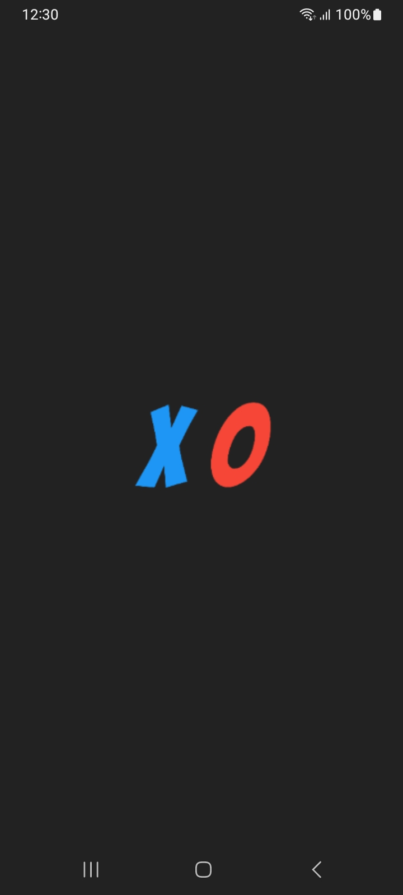
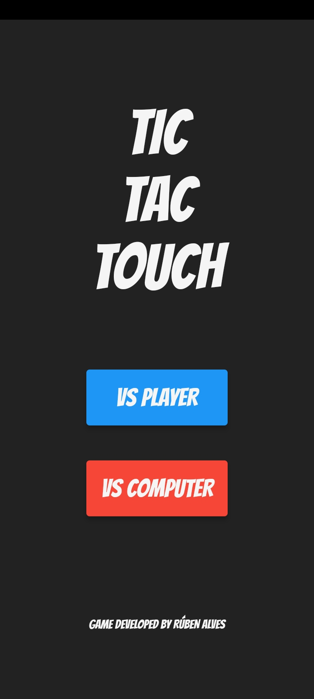
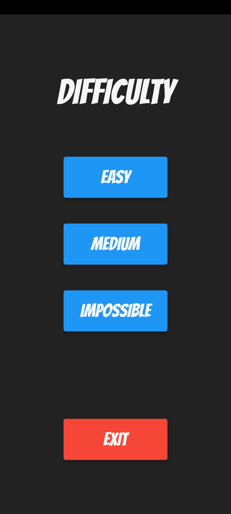
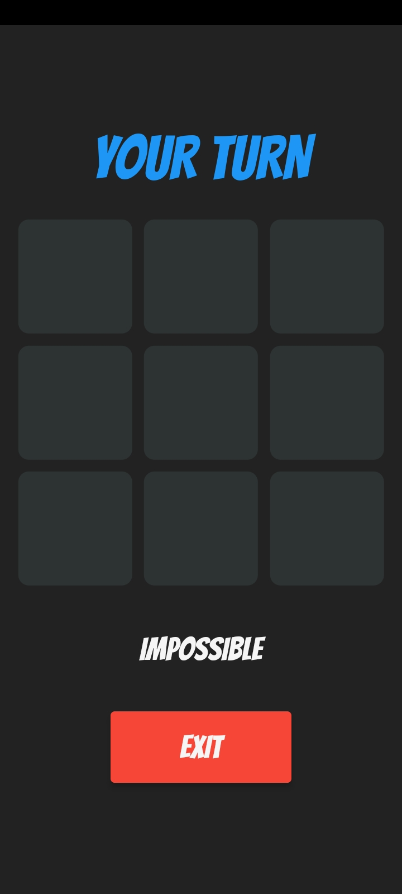

# Tic Tac Touch 🎲

Tic Tac Touch is a mobile game developed with Flutter, featuring the minimax algorithm to deliver an engaging Tic-Tac-Toe experience.

## Description 🔍

Tic Tac Touch is an offline mobile game that provides players with the opportunity to indulge in the timeless classic of Tic-Tac-Toe. Players can face off against another human player or challenge themselves against three distinct AI difficulty levels.

Tic-tac-toe is a game in which two players take turns in drawing either an 'X' or an 'O' in one square of a grid consisting of nine squares. The winner is the first player to get three of the same symbols in a row.

The game's AI provides three distinct difficulty levels: 'Easy', where it makes random moves to available grid squares; 'Medium', which avoids random moves but still commits occasional errors; and finally, 'Impossible', where victory for the player is virtually impossible.

In conclusion, Tic Tac Touch's primary objective is to offer users an enjoyable experience while playing Tic-Tac-Toe through an intuitive and user-friendly interface.

## Files & Directories 📁

- `assets` This directory contains various static assets used in the project.
    - `fonts` This subdirectory contains a font file named `Bangers-Regular.ttf`.
    - `images` This subdirectory contains image files used in the app, including `background.png` and `icon.png`.

- `lib/src` This directory contains the main source code for the application.
    - `constants` This subdirectory contains a Dart file named `colors.dart` that defines colors used throughout the app.
    - `screens` This subdirectory contains three Dart files that define the screens of the app.
        - `difficulty_screen.dart` This Dart file defines the screen for selecting the AI difficulty level.
        - `home_screen.dart` This Dart file defines the home screen of the app.
        - `play_screen.dart` This Dart file defines the screen where the gameplay takes place.
    - `widgets` This subdirectory contains Dart files that define custom widgets used throughout the app.
        - `custom_elevated_button.dart` This Dart file defines a custom elevated button widget with specific styling.
        - `custom_text.dart` This Dart file defines a custom text widget with specific styling.
    - `main.dart` This is the main entry point for the application, where the app is initialized and the main widget tree is built.

## Installation 🔨

If you're a developer looking to test or develop with Tic Tac Touch using VSCode, follow these steps:

1. Clone the Repository: Open VSCode, navigate to your desired workspace, and clone the app's repository using Git.

```
git clone <repository url>
```

2. Install Dependencies: Open the terminal in VSCode and navigate to the app's root directory. Run the following command to install the required dependencies:

 ```
flutter pub get
 ```

3. Run the App: Now you can run the app on an emulator or a physical device by executing:

 ```
flutter run
 ```

## Support 📱

- [x] Android
- [ ] iOS

## Features 💡

- [x] User-friendly interface
- [x] Responsive UI
- [x] Play offline versus another player
- [x] Play versus three AI difficulty levels
- [ ] Game audio

## Walkthrough 📋

 ### Splash Screen
 
 The first screen you'll encounter upon launching the app is the splash screen. It displays the app's icon and provides a visual introduction to Tic Tac Touch.

 

 ### Home Screen
 
 After the splash screen, you'll arrive at the home screen. Here, you'll find the following elements:

 - Game Title: The game's title prominently displayed at the top.

 - 'vs Player' Button: By tapping this button, you can start a two-player offline game.

 - 'vs Computer' Button: Selecting this option takes you to the difficulty selection screen for playing against the AI.

 

 ### Difficulty Screen

 If you choose to play against the computer, you will be presented with a screen where you can select the AI difficulty level. You have the following options:

 - 'Easy' Button.

 - 'Medium' Button.

 - 'Impossible' Button.

 - 'Exit' Button: Allows you to go back to the home screen if you change your mind.

 

 ### Play Screen

 Once you've made your choice, whether it's 'vs Player' or a specific difficulty level for "vs Computer", you'll be taken to the play screen. Here, you'll find:

 - Player Information: This area displays whose turn it is, either "X's Turn" or "O's Turn" in the case of a two-player game. In 'vs Computer' mode, it will show "Your Turn" or "Computer's Turn" accordingly.

 - Game Board: The Tic-Tac-Toe grid where you make your moves by tapping on empty cells. Your moves are marked with 'X', and the opponent's moves with 'O'.

 - 'Exit' Button: You can use this button to exit the game and return to the home screen at any time.

 When the game ends, whether in a win, lose, or draw, the result will be displayed in the area that previously showed whose turn it was. Additionally, the 'Exit' button is replaced by a row of two buttons:

 - 'Play Again': Allows you to start a new game with the same settings.

 - 'Exit': Takes you back to the home screen.

 

## License 🧾

Tic Tac Touch is available under the MIT license. See the [LICENSE](LICENSE) file for more info.